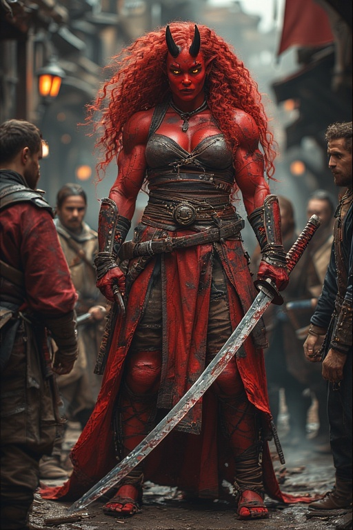

## Background
Matara was born to a nomadic Orc tribe in Tian Xia, but her red skin made her an outsider from the moment she was born; she was feared
by her tribe who knew how the great Onis would terrorise them on their wanderings. Her mother wouldn't have even wanted to let her suckle
if she wasn't afraid to make the Onis mad. So she grew up without friends and what little family she had avoided her as much as they
could. Once her horns grew out not even her mother would even look at her. She could not feel at home with them, wherever they were: this
was not her home. The first opportunity she got, she fled into a city they were travelling by.

This didn't help much; she was a Hungerseed urchin without any family. The Goka city dwellers all hated Onis too, and she had to fend for
herself to have any chance at survival. She slept in alleys, and did her best to earn a living. Whenever she managed to scrounge up a
little coin she slept where she could find a bunk that she could afford, even though the prices tended to be jacked up by the innkeepers
or hostelries. She carried everything she could scrounge up with her, and trained herself to improve her lot. After a few years she grew
taller and larger; she had always been taller than the other Orc kids her age, not to mention the other urchins in the city. But she was
only 7 and already as tall as most adult humans. Her big stature did mean that she was less likely to be accosted, and it helped her
protect some of her fellow urchins who hadn't learned to fear Onis yet. But as time grew by, they all started to fear her eventually and
left her. This city too, was not her home.

She wanted to get as far away from Tian Xia as she could, hoping to find a place where no one knew of Onis, so she took a place as a
deckhand on a ship headed for she didn't even know where. Just away. As far as possible. The journey started out fine, she learned to get
along with the rest of the crew and managed to finally make a few friends. The crew was mixed with many different races, they were from
all over the world; Absalom, Andoran, even Cheliax ... places Matara had never heard of, but she learned their language, and she thought
life was looking up! This ship and this crew, she thought she could call them home.

But disaster struck. After weeks out on sea they were finally nearing the island of Jalmeray where they were going to sell some cargo and
resupply. However a storm descended and threw them far off course and they were shipwrecked on the coast of the Mana Wastes. Matara
herself had gotten injured in the storm; some piece of shrapnel that had been brought by the storm had hit her square in the chest and
lodged itself there. Ship crews being a superstitious lot all blamed the one newcomer: they blamed Matara. So they didn't try to help her
and just left her to fend for herself while they went to Geb. Matara wasn't surprised. She had grown used to this kind of betrayal. But
maybe this was a sign. The piece of shrapnel seemed to burn inside her, but she couldn't dislodge it, and after a few hours the skin
seemed to miraculously heal above it, only leaving a scar behind. She could still feel it inside her, like a warm spark.

She decided to try to make a life for herself here in the Mana Wastes. This was as good a place as any; she had not heard the other
sailors even mention Onis so she was pretty sure they weren't very well-known in these parts. Maybe nobody would fear her just because of
her heritage. She gathered up whatever she could find from the wrecked ship that the other sailors hadn't taken with them when they left
and set out to find somewhere to make a home. She eventually got to Alkenstar, and the city seemed to embrace her. It was clear nobody
recognised her Oni heritage, or if they did, they didn't realise how terrifying Onis could be. Nobody even realised she was only 9, and
just based on her size alone she easily got hired as a bouncer or body guard for various saloons and patrons in the city. She got paid
well, and she grew even larger as time went by. Over the next 10 years she made enough money to get a comfortable appartment, some decent
body guard gear, and plenty of food every day. She didn't stay with a single employer very long, but all of them were still alive when
she left their service, so her reputation grew. Eventually she joined a bodyguard organisation called The Silver Gauntlet. This was
finally home.

And then she got a job from Ambrost Mugland. She had heard of him, and knew he would be able to pay well so she eagerly accepted. The job
was simple: be his body guard for the next week while he attended to some business. Half payment up front, other half after the week if
nothing untoward had happened. Matara was just going home after the first day on the job, and as she rounded a corner she saw her place
surrounded by the Shieldmarshals. She didn't know what had happened, but it must have something to do with the new job. She hurried back
to Ambrost, thinking he must be made aware that the Shieldmarshals were looking for her in relation to him, and as she got back to his
compound, she saw him chatting with one of the Shieldmarshals and overheard something about "That red devil will soon be captured, don't
you worry."

It was obvious: her new employer Ambrost Mugland was trying to have her arrested. Another betrayal. Another city who fears her just
because she's different. "Not again! I refuse to accept it!"

## Details
* **Deity**: None, but enjoys the teachings of Nocticula
* **Age**: 19
* **Height**: 8 feet
* **Skin tone**: Red
* **Hair**: Curly red
* **Eyes**: Golden
* **Horns**: Not very large, she usually wears horn extenders to make them look bigger
* **Languages**: Common, Tien, Orcish

## Stats

### Level 1
* **Ancestry**: Hungerseed Orc
* **Background**: Junker
* **Class**: Exemplar
* **Ikons**: Scar of the Survivor, Gaze Sharp as Steel, Barrow's Edge
* **Attributes**: Str +4, Dex + 3, Con +1, Int +0, Wis +0, Cha +1
  * Ancestry: Str, Dex
  * Background: Str, Dex
  * Class: Str
  * Base: Str, Dex, Con, Cha
* **Skills**: Acrobatics (T), Athletics (T), Deception (T), Intimidation (T), Religion (T), Junkyard Lore (T)
* **Feats**:
  * **Ancestry**: Oni Weapon Familiarity
  * **Background**: Hefty Hauler
  * **Exemplar**: [Ancestral Might](Ancestral%20Might.MD)
  * **Exemplar**: Shield Block
  * **Bonus Feat**: [I, Endure](I,%20Endure.MD)
* **Speed**: 25 feet
* **Special Abilities**: Darkvision, Horns unarmed attack (1d6P in brawling group)

### Level 2
* **Ability Boost**: Con (+2)
* **Exemplar Feat**: Leap the Falls
  * **Skill Feat**: Powerful Leap
  * **Skill Feat**: Quick Jump
* **Skill Feat**: Intimidating Glare
* **Free Archetype**: Fighter Dedication
  * **Trained in Skill**: Thievery
* **Skills**: Acrobatics (T), Athletics (T), Deception (T), Intimidation (T), Religion (T), Thievery (T), Junkyard Lore (T)

### Level 3
* **Ability Boost**: Cha (+2)
* **Skill Increase**: Athletics (E)
* **General Feat**: Ancestral Paragon
  * **Ancestry Feat**: Oni Form
* **Root Epithet**: The Brave
  * **Trained in Skill**: Stealth
* **Skills**: Acrobatics (T), Athletics (E), Deception (T), Intimidation (T), Religion (T), Stealth (T), Thievery (T), Junkyard Lore (T)

### Level 4
* **Ability Boost**: Dex (+4)
* **Exemplar Feat**: Basic Maneuver (Fighter Dedication)
  * **Fighter Feat**: Lunge
* **Skill Feat**: Rapid Mantel
* **Free Archetype**: Reactive Striker (Fighter Dedication)

### Level 5
* **Ability Boost**: Str (+4+)
* **Ancestry Feat**: Bloodsoaked Dash
* **Skill Increase**: Intimidation (E)
* **Skills**: Acrobatics (T), Athletics (E), Deception (T), Intimidation (E), Religion (T), Stealth (T), Thievery (T), Junkyard Lore (T)

### Level 6
* **Exemplar Feat**: Motionless Cutter
* **Skill Feat**: Intimidating Prowess
* **Free Archetype**: Advanced Maneuver (Fighter Dedication)
  * **Fighter Feat**: Intimidating Strike

### Level 7
* **Ability Boost**: Str (+5)
* **General Feat**: Fleet
* **Skill Increase**: Athletics (M)
* **Dominion Epithet**: Restless as the Tides
* **Skills**: Acrobatics (T), Athletics (M), Deception (T), Intimidation (E), Religion (T), Stealth (T), Thievery (T), Junkyard Lore (T)
* **Speed**: 30 feet

### Level 8
* **Ability Boost**: Con (+3)
* **Exemplar Feat**: Additional Ikon
  * **Ikon**: Thousand League Sandals
* **Skill Feat**: Wall Jump
* **Free Archetype**: Advanced Maneuver (Fighter Dedication)
  * **Fighter Feat**: Slam Down
